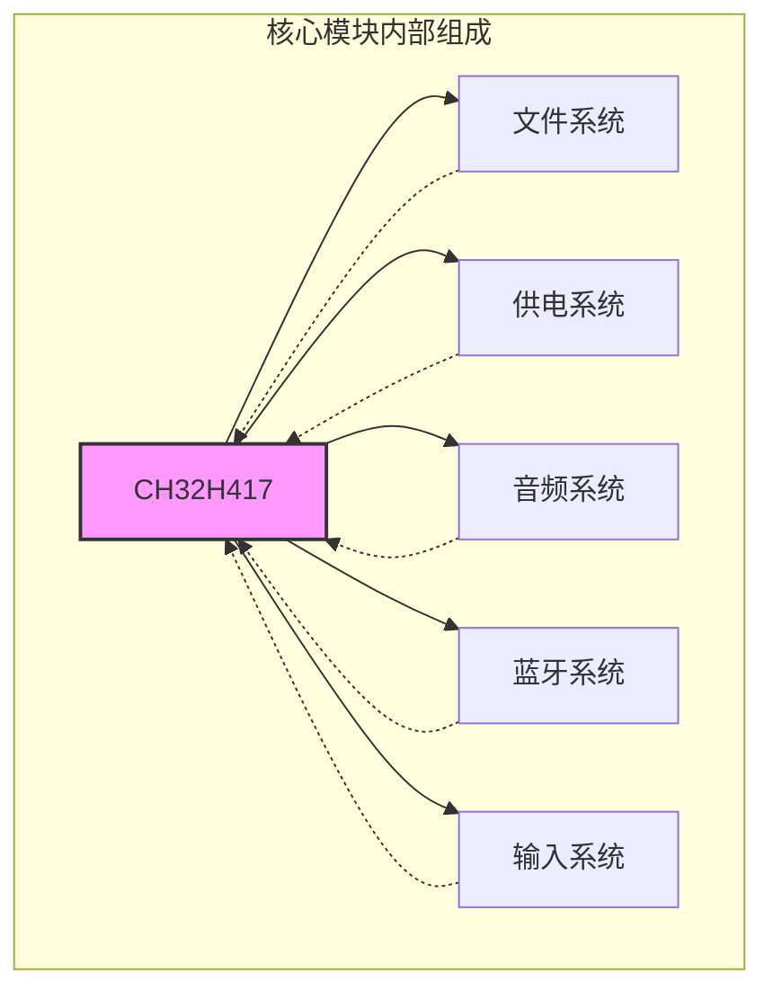
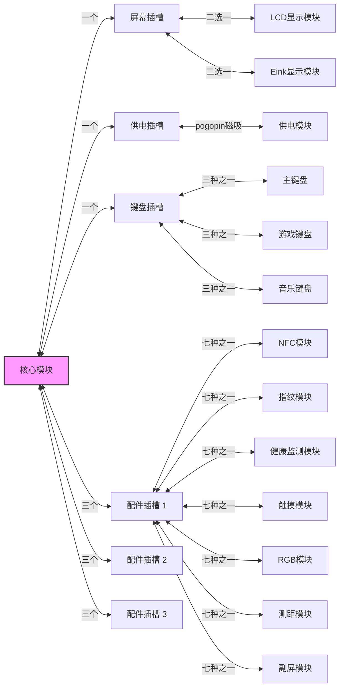
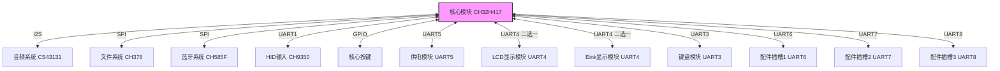

# 摘要

本作品采用青稞RISC-V架构的CH32H417芯片作为核心芯片，旨在设计一台模块化的个人移动终端，满足用户对移动设备的多样化需求。该移动终端主要分成核心模块、供电模块、显示模块、配件模块、键盘模块五个部分，支持各个部分的独立更换和定制，提供灵活的硬件扩展能力和定制化体验。模块可在核心底板上自由组合，终端自动识别其组成，最终实现文本编辑器、电子书、播放器、电子琴、游戏机等多样功能，替代多种单一功能终端。

## 功能与特性

本作品可以通过模块的自由组合实现不同的功能。单独使用核心模块可以使用Type-C线供电，也可以使用供电模块供电，单独使用的情况下，可以采用手机APP利用蓝牙和核心模块进行可视化交互，主要实现文件系统访问、音乐播放、文字编辑等功能，也可以在手机APP上通过命令行进行交互，设计了大量CLI命令供使用。安装屏幕的情况下，可以通过触摸的方式和系统进行交互，设计了许多应用和数个小游戏可供使用，也可以通过UI的方式进行设置配置。键盘输入可以使用符合HID标准的键盘通过USB输入，也可以使用本作品设计的三种键盘键盘进行输入，满足不同的输入需求，标准键盘和游戏键盘同时支持HID输出，可以单独给其他设备使用，高度开放、可扩展。供电模块除了安装在核心模块上可以进行供电，也可以单独拿出来当充电宝使用，便于携带，支持PD和无线充电。本作品拥有三个配件槽位，支持使用设计中的七种配件给作品做功能扩展，以实现不同的独特功能。

## 应用领域

本作品应用领域较为广泛，主要目标是构建一种不同的移动终端形态，实现便携式播放器、掌上游戏机、电子书、文本编辑器、电子琴的融合。主要面向人群是喜爱模块化设计终端的电子爱好者和希望将手上不同的小型设备进行融合的日常使用者，也可以供嵌入式学习者进行研究、复刻、扩展，模块化程度高便于爱好者设计自己的模块加入其中。作为模块化的移动终端，适合用户在不同情境下使用不同的模块组合出自己想要的设备，也适合在某个模块损坏的时候进行替换。

## 主要技术特点

1. 模块化。本作品最大的特点就是模块化，高度的模块化使得作品高度可定制并且可替换，在设计实现的过程中也详细地考虑到了不同场景下的可用性，不强制用户将所有模块都安装，支持不同组合形态，也支持在缺失某些模块的情况下使用，以满足不同的便携性需求，甚至也支持外部输入和向外输出，某些模块也支持单独进行使用。模块支持热插拔，核心模块会自动识别当前的模块组成。
2. 磁吸式连接。本作品采用磁吸式连接，用户可以将不同的模块通过磁吸式连接到核心模块上，实现模块的自由组合和扩展。
3. 沁恒方案。本作品采用大量沁恒芯片，包括CH32H417、CH32V307、CH32V103、CH585、CH378、CH9350、CH9329，利用沁恒芯片的多样性实现不同的功能。

## 主要性能指标

1. 续航能力。使用供电模块的情况下，根据不同的使用情况，拥有2-20h的续航能力。
2. 性能。本作品采用分布式计算设计，每个模块都拥有各自的计算能力，可以进行独立的计算和处理，使得作品的流畅度和响应速度都得到了提升。
3. 便携性。本作品通过3D打印的方式为所有模块建立了外壳，保持了模块的独立性，同时也方便了用户的携带和使用。

## 主要创新点

1. 模块化设计。本作品创新性地分离了供电、屏幕、键盘、配件，使得用户可以根据自己的需求选择不同的模块组合，实现不同的功能。
2. 分布式设计。各模块之间采用串口进行通信，由核心模块进行统筹协调，实现了模块之间的通信和数据交换。同时赋予部分模块独立运行的能力。
3. 自建UI系统。本作品为了实现LCD和墨水屏之间的统一，设计了一套UI系统，实现了在不同屏幕上的统一操作，输入系统支持多种输入方式，渲染系统高度支持局部刷新。

## 设计流程

1. 构思。根据模块化移动终端的需求，分离出核心模块、供电模块、显示模块、配件模块、键盘模块五个部分。
2. 系统设计。根据五个模块，设计连接方式和作品形态，考虑了模块的独立性和可组合性，设计了要实现的模块种类。
3. 详细设计。根据系统设计，对每个模块进行硬件设计、外壳设计、软件设计，实现硬件软件外壳之间的协调。

# 系统组成及功能说明

## 整体介绍

系统整体组成如下：
1. 核心模块。核心模块是系统的核心，承载了系统的整体调度。核心模块本身拥有主控、文件系统、供电系统、音频系统、蓝牙系统、输入系统。核心模块向外拥有一个屏幕插槽、一个供电插槽、一个键盘插槽、三个配件插槽，均采用pogopin磁吸连接，各个子模块通过接口连接到核心模块上实现组合。
2. 供电模块。供电模块是系统供电的来源，采用Type-C线PD快充，同时支持向外PD快充和无线放电，通过pogopin连接到核心模块上。
3. 显示模块。显示模块有两种，一种是LCD显示模块，一种是Eink显示模块，通过统一的屏幕插槽pogopin连接到核心模块上。
4. 键盘模块。设计有三种键盘模块：主键盘、游戏键盘、音乐键盘。采用统一的pogopin连接到核心模块的键盘插槽上。
5. 配件模块。设计有七种配件模块：指纹模块、健康监测模块、NFC模块、触摸模块、RGB模块、测距模块、副屏模块。均采用统一的pogopin连接到核心模块的配件插槽上，个别模块拥有不同的大小，支持自由组合。

## 软件系统介绍

### 软件整体介绍

软件上主要采用分布式设计，各个模块都有自己的主控，通过串口和核心模块的CH32H417进行通信，由核心模块进行协调和数据交换，模块间定义了完整的通信协议。主要计算在模块内部发生，传回核心模块的通常是计算结果和指令，再由核心模块进行转发和命令执行。

### 软件各模块介绍

#### 核心模块

核心模块的软件基于沁恒 CH32H417 双核 RISC-V 微控制器构建，所有业务逻辑统一运行在 V5F 核心上，V3F 仅负责上电后初始化时钟并唤醒 V5F，随后进入 STOP 低功耗模式。V5F 以裸机主循环的方式调度音频 DAC、文件管理芯片、蓝牙无线芯片、显示模块、键盘模块、供电模块、配件模块以及 HID 转串口等所有外设。初始化阶段依次完成 CS43131 音频 DAC、CH378 文件系统、配置系统、命令行接口、CH585F 蓝牙、显示模块、核心按键、供电模块、CH9350 HID 转换、键盘模块和三个配件槽位的初始化，并建立心跳槽位用于模块在线检测。主循环每毫秒执行一次，依次处理显示刷新、音频数据补充、命令行交互、蓝牙轮询、按键扫描、键盘协议、供电协议、三个配件槽协议和 HID 输入，最后通过硬件心跳统一检测各模块状态。核心模块内部维护全局状态结构体 hardware_g，集中管理所有模块的运行状态、配置信息和 RGB 自定义帧等共享数据，整个调度过程不依赖 RTOS，完全通过轮询加中断实现。

核心模块的音频引擎基于 CS43131 构建了两通道虚拟混音系统。文件播放时通过 CH378 以时分复用的方式从 TF 卡或 U 盘读取 WAV 数据，为每个通道维护 16KB 的环形缓冲，DMA 双缓冲以 I2S 输出到 DAC。该引擎支持全局音量、独立通道音量与声像控制，并内置三段 EQ、压缩器和 Echo 效果器链，在 DMA 中断中按 EQ、压缩器、Echo 的顺序实时处理。文件系统方面，核心模块通过 CH378 管理 TF 卡和 USB 存储设备，音频播放期间 CH378 不会被独占，其他模块仍可通过显式锁机制进行文件读写。蓝牙系统通过 SPI 与 CH585F 通信，负责与手机 APP 的数据交换和可视化交互。HID 输入通过 CH9350 接收标准 USB 键盘和鼠标事件，并转换为系统输入。配置系统采用 JSON 持久化，保存用户设置并在启动时加载。命令行接口提供大量音频控制、文件浏览和系统调试命令，允许用户在不接屏幕的情况下通过串口与设备交互。

#### 供电模块

供电模块运行在 CH32V103C8T6 上，其电源管理核心为 IP5568 芯片。IP5568 独立完成双向 PD 快充、无线充电、电池充放电管理以及 5V 稳压输出，并通过七段 LED 实时显示电池电量。CH32V103C8T6 不直接控制电源路径或充电协议，而是监听并解析 IP5568 驱动的七段 LED 刷新时序，从中提取当前电池电量百分比。模块上电后初始化时钟、GPIO 和 UART1，以 921600 波特率与核心模块建立通信，响应心跳和类型查询，并周期性上报电量信息。当供电模块通过 Type-C 接入电源或作为充电宝对外输出时，所有快充握手、功率协商和保护逻辑均由 IP5568 硬件完成，CH32V103C8T6 仅负责将电量状态透明转发给核心模块。核心模块根据电量决定降频、关闭背光或暂停非必要模块等策略，供电模块本身不做功耗决策。

#### LCD显示模块

LCD 显示模块同样采用 CH32H417 双核架构，V5F 负责 UI 渲染和屏幕驱动，V3F 负责与核心模块的 UART 通信。V5F 初始化 FMC 8080 总线和 SSD1963 驱动芯片，加载自研 MiniUI V2.0 框架，维护深度为 16 的页面栈并支持脏区域跟踪局部刷新。V3F 初始化 UART1 协议帧接收状态机，以 921600 波特率接收核心模块下发的页面切换、状态栏更新、通知弹窗和背光调节等指令，并通过 HSEM 与共享内存通知 V5F 执行。与此同时，V3F 也将本地触摸事件、屏幕唤醒事件和异常状态主动上报核心模块。该模块运行本地应用和小游戏，如文件管理、音乐播放器、俄罗斯方块、2048 和贪吃蛇等，这些应用在本地独立完成，不依赖核心模块。MiniUI 框架统一抽象了触摸、鼠标和键盘输入，支持页面过渡动画、控件库和字体渲染，核心模块侧通过显示协议远程驱动副屏上的页面和内容显示。

#### Eink显示模块

Eink 显示模块运行在 CH32V307RCT6 上，使用 5.83 寸黑白电子墨水屏，与 LCD 显示模块共用同一套通信协议和 MiniUI 框架，但渲染层针对 1bpp 像素格式进行了适配。模块初始化 SPI1 接口与 JD79686AB 驱动芯片通信，配置 BW 模式的 LUT 波形和系统寄存器，建立 UART1 协议接收状态机。墨水屏支持全屏刷新和局部刷新两种模式，全屏刷新约需 4 秒，局部刷新则可在 0.3 到 1 秒内完成，局部刷新时 X 和 W 必须为 8 的倍数，且模块内部维护 4KB 旧数据缓冲区以计算差分更新。由于 32KB RAM 无法缓存全帧，全屏刷新采用流式逐行发送数据。模块上电后默认处于待机状态，响应核心模块的心跳和类型查询，收到显示指令后执行内容渲染与刷新。后续将进一步移植 MiniUI 框架和字库渲染引擎，使墨水屏上的交互体验与 LCD 屏保持一致，并针对低功耗场景优化刷新间隙的 MCU 休眠策略。

#### 主键盘模块

主键盘模块基于 CH32V103C8T6 实现，采用约 40% 配列的机械按键矩阵，同时具备向核心模块上报和向电脑输出 HID 报告的双通道能力。初始化阶段配置按键矩阵 GPIO、UART1 与核心模块通信、UART2 与 CH9329 串口转 HID 芯片通信，并将 CH9329 设置为标准键盘模式。运行阶段以定时器中断周期扫描矩阵，检测按键按下、释放和长按事件，经软件消抖后将物理行列坐标映射为逻辑键码，支持多层配列和 Fn 组合键。同一事件同时通过 UART1 向核心模块发送自定义协议键码，并通过 UART2 经 CH9329 转换为 USB HID 键盘报告从 USB-A 接口输出。因此即使不插入移动终端，主键盘模块也可以作为独立键盘连接电脑使用。模块还响应核心模块下发的背光调节和布局查询命令，便于核心模块在 UI 上显示虚拟键盘或快捷键提示。

#### 游戏键盘模块

游戏键盘模块同样运行在 CH32V103C8T6 上，面向游戏操控场景，采用方向键、双轴模拟摇杆和四个功能键的布局。初始化阶段配置方向键与功能键 GPIO、双轴摇杆 ADC、UART1 与核心模块通信以及 UART2 与 CH9329 的摇杆模式通信。运行阶段定时扫描按键状态，并通过 ADC 采集摇杆 X 和 Y 轴位置，软件对摇杆做死区处理与归一化，避免机械中位漂移造成误操作。按键与摇杆事件同时通过 UART1 上报核心模块，并通过 UART2 经 CH9329 输出标准 HID 游戏控制器报告。游戏键盘与主键盘共用模块 ID，核心模块通过子类型区分两者，并将输入路由到对应的应用或游戏引擎。和主键盘一样，游戏键盘模块也能脱离移动终端单独作为电脑游戏手柄使用。

#### 音乐键盘模块

音乐键盘模块运行在 CH32V103C8T6 上，提供 24 个电容触摸琴键、三个调音推子和 12 个控制按钮，用于核心模块上的电子琴和合成器应用。初始化阶段配置 TTP229 串行接口读取两片触摸芯片的 24 位琴键状态，配置 ADC 采集三路推子，配置 GPIO 读取 12 个按钮，并建立 UART1 通信。由于 TTP229 响应时间为 32 毫秒，琴键与按钮扫描周期设置为 5 到 10 毫秒，推子采样则通过滑动平均滤波消除电位器抖动。模块上电后默认处于待机状态，仅响应心跳和类型查询，核心模块发送开始输出命令后进入事件驱动上报模式，仅在琴键位图、按钮位图或推子值发生变化时通过 UART1 上报。琴键采用标准钢琴布局覆盖两个八度，核心模块可直接根据键编号加 59 计算 MIDI 音符号，并由核心模块侧的 CS43131 完成音频合成与播放。该模块不含 CH9329，因此不能独立接电脑使用，必须与核心模块协同工作。

#### 指纹模块

指纹模块运行在 CH32V103C8T6 上，通过 UART2 与支持 Syno 协议的光学或电容式指纹传感器通信，通过 UART1 与核心模块通信。模块上电后初始化指纹传感器，发送握手指令验证通信，读取有效模板数量，并向核心模块上报子类型。默认情况下模块处于自动验证模式，当手指按压传感器时，TOUCHOUT 引脚触发下降沿中断唤醒主控，主控发送自动验证指令，传感器内部完成采图、生成特征和搜索匹配，验证成功后通过 UART1 上报核心模块指纹 ID 和名字，验证失败则上报错误码。核心模块也可以发起注册流程，模块收到指令后启动传感器的自动注册功能，完成后将新指纹 ID 和名字上报。模块还支持删除指定指纹、清空指纹库、查询指纹列表和索引表、控制传感器呼吸灯效以及设置安全等级等操作。所有指纹模板数据存储在传感器自带的 Flash 中，核心模块不直接处理指纹图像，模块仅作为协议转换桥梁完成 Syno 协议与核心模块统一协议之间的转发。

#### 健康监测模块

健康监测模块运行在 CH32V103C8T6 上，通过 I2C 与 MAX30102 心率血氧传感器通信，并通过 UART1 与核心模块通信。初始化阶段配置 I2C 和 UART1，设置 MAX30102 的采样率、LED 电流和 FIFO 中断阈值，并配置传感器中断引脚。运行阶段从传感器 FIFO 读取光电容积脉搏波原始数据，经过软件滤波去除基线漂移和运动伪影后，通过峰值检测计算心率，通过红光与红外光的直流和交流分量比值估算血氧饱和度，并通过相邻 RR 间期的标准差计算心率变异性。处理后的数据通过定时主动上报或响应核心模块查询的方式回传，当心率或血氧超出预设阈值时立即上报告警事件。由于 CH32V103 算力有限，算法采用轻量级峰值检测和滑动平均，精度满足消费级场景。模块与显示模块协同工作，健康数据由核心模块转发至显示模块以图表或数字形式呈现。

#### NFC模块

NFC 模块运行在 CH32V103C8T6 上，通过 UART2 接收专用 NFC 读卡模块输出的卡号数据，并通过 UART1 与核心模块通信。NFC 读卡模块以 9600 波特率每 91 毫秒主动输出一次 8 字节数据帧，包含帧头、路由号、5 字节卡号和奇偶校验字节。CH32V103 在 UART2 中断中逐字节接收并解析帧格式，验证帧头和校验字节，仅保留路由号在 0x30 到 0x33 范围内的有效帧。为避免卡片在天线边缘反复触发导致误报，软件对连续识别到的卡号做去抖处理，通常连续识别到相同卡号 5 次后才通过 UART1 向核心模块上报卡片识别事件。模块上电后向核心模块上报子类型，运行期间响应心跳和状态查询，若没有有效卡片则返回空卡信息。由于 NFC 读卡模块本身不可配置，主控仅负责数据解析和协议转发，整个逻辑相对简洁。

#### 触摸模块

触摸模块运行在 CH32V103C8T6 上，通过两片串行线连接 TTP229-BSF 电容触摸芯片，读取 16 个触摸焊盘的状态。16 个触摸焊盘组成 2×2 中心方阵和 12 位环绕圆环，对应 16 个键 ID。初始化阶段配置 TTP229 为 16 键串行输出模式并启用多键触发，等待 500 毫秒上电稳定后捕获空闲状态作为基线，以消除 PCB 寄生电容影响。运行阶段以不低于 10 毫秒的周期读取 TTP229 的 16 位串行数据，将原始触摸引脚位图映射为键 ID 状态，当任意键状态变化时通过 UART1 向核心模块上报触摸事件。圆环支持顺时针和逆时针滑动手势识别，方阵则适合方向控制或功能选择。模块响应核心模块的模式设置和状态查询命令，支持多键同时检测，可用于音乐控制、菜单浏览和灯效调节等场景。

#### RGB模块

RGB 模块运行在 CH585F 上，使用 SPI0 的 MOSI 引脚驱动 7×7 共 49 颗 WS2812 可寻址 LED，实现动态灯光效果。模块采用纯超级循环架构，不使用蓝牙协议栈和事件调度器，以 SysTick 提供 1 毫秒时间基准，主循环交替执行 UART0 协议解析和 LED 灯效渲染。WS2812 的单线归零码通过 SPI 2.5 兆赫兹时钟以 3 个 SPI 位编码 1 个 WS2812 位的方式精确模拟。模块内部使用 HSV 色彩空间作为中间态，饱和度强制为最大值以保证颜色鲜艳，通过 V 分量全局控制亮度。模块支持自定义帧动画、常亮、呼吸和跑马灯四种模式，其中自定义模式允许核心模块逐帧传输 49 颗 LED 的 RGB888 数据，最多缓存 20 帧并按指定间隔循环播放。核心模块通过 SET_MODE 命令设置模式、颜色、亮度和速度，模块收到命令后立即更新灯效并周期性上报当前状态。由于全白时电流可达 3 安培，实际使用需根据模块供电能力控制亮度。

#### 测距模块

测距模块运行在 CH32V103C8T6 上，通过 I2C 与 VL53L0X 飞行时间激光测距传感器通信，并通过 UART1 与核心模块通信。初始化阶段通过 XSHUT 引脚复位传感器，配置 I2C 地址和默认测距模式，建立 UART1 协议状态机。模块上电时模块 ID 未知，收到核心模块的 GET_TYPE 命令后从帧的 DST 字段学习自身在配件槽中的实际地址，后续所有响应均使用学习到的 ID。核心模块发送开始测距命令后，模块启动 VL53L0X 连续测距模式，传感器数据就绪引脚触发外部中断，主控读取最新距离值并做滑动平均或中值滤波，消除单次测量跳变。核心模块通过查询 GET_TYPE 获取测距结果，模块在 ACK 之后紧接着发送测距数据帧。核心模块控制查询频率，从而控制数据更新频率。测距停止命令下达后，传感器进入待机状态，模块仅回复类型查询而不发送测距数据。该模块适用于手势感应、物体接近检测和简易测距应用。

#### 副屏模块

副屏模块运行在 CH32V103C8T6 上，通过 SPI 驱动 2.13 寸全反式反射液晶屏，并通过 UART1 与核心模块通信。全反屏无背光，依靠环境光反射显示，在强光下清晰可见，静态显示几乎不耗电，因此非常适合常显信息面板。初始化阶段配置 SPI 和 UART1，初始化 ST7305 驱动芯片的分辨率、扫描方向和刷新模式。运行阶段响应核心模块的心跳和类型查询，通过 UART1 接收状态数据、自定义内容、清屏指令和 BMP 批量传输数据。模块可以主动向核心模块请求系统运行状态、当前在线设备列表以及 BMP 图片文件，核心模块解析为 1 位位图后通过批量传输多帧发送。由于分辨率仅为 122×250，模块采用固定布局分区显示，如顶部状态栏、中部大字体时间和底部图标行，避免复杂 UI。刷新速率较慢，模块在收到指令后会对短时间内连续到达的多条更新做内容合并，减少无效刷新。刷新完成后 CH32V103 可进入睡眠模式，仅保留 UART 唤醒中断，进一步降低整机功耗。
